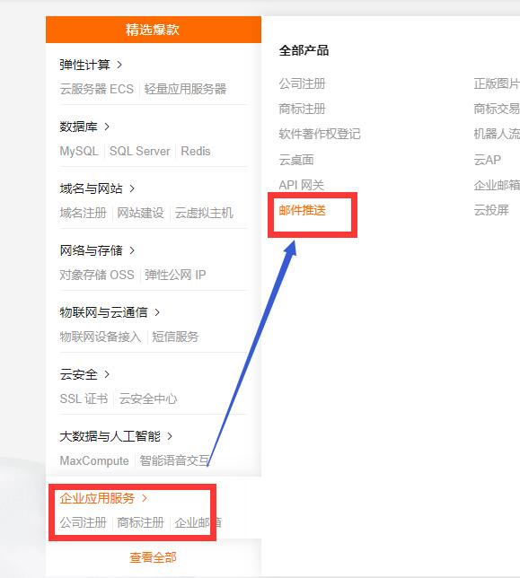

  

> 第二次活动的主题教程和素材仓库

## 基本练习

1. 【fork练习】`Fork`本仓库，并`clone`你的fork生成的仓库到本地；
2. 【Node依赖管理练习】安装Node环境，并在根目录下执行`npm --registry https://registry.npm.taobao.org install`；
3. 【pull request练习】当你完成以下的快慢加密练习和SMTP练习之后，commit并推到变动到你的fork仓库，向我的源仓库提出`pull request`；

## 快慢加密

在工程目录下，有一个`sf-hash`文件夹，包含以下文件：

- `Backend.js`: 模拟的后端实现类
- `Frontend.js`: 模拟的前端实现类
- `configure.js`: 配置文件，这里的是模拟用户输入的账户和密码
- `simulator.js`: 快慢加密的流程
- `test.js`: 单元测试文件

你需要完成`Backend.js`和`Frontend.js`中相应的【TODO】，然后在主目录下，执行(Windows)`CallShell.bat`文件，输入命令行:`npm run sf-test`，当你看到以下内容时，说明你完成了测试：

## SMTP练习

> 这个练习需要拥有一个域名(强烈推荐)，如果没有域名，临时用QQ邮箱之类的也行。

**① 拥有域名的同学**

1. 学会解析DNS，了解MX\TXT\CNAME记录
2. 上手阿里云/腾讯云的`邮件推送服务`
3. 获取你域名的SMTP账号和密码

阿里云操作流程：

1. 新建域名，如`mail.<your-domain>`；
2. 点击【配置】，会出现各类DNS记录配置值；
3. 打开DNS控制台，按照上面看到的提示值配置；
4. 回到邮件推送控制台，验证(可能需要等待几分钟)；
5. 新建一个发信账号，如`robot`，并设置它的SMTP密码`<your-smtp-password>`；

此时，你的发信账号就是`robot@mail.<your-domain>`。

**② 没有域名的同学**

百度【qq邮箱 SMTP】，获取你的SMTP账号和密码

---

进入`mail`，里面有四个文件：

- `mailer.js`: 封装好的nodemailer函数
- `mailer-configure.js`: SMTP配置文件
- `general.template.html`: 邮件的模板
- `send-mailer.js`: 发送脚本